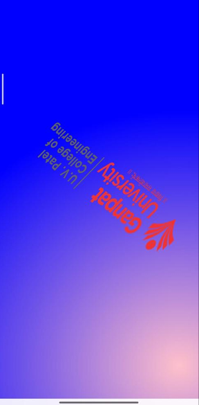
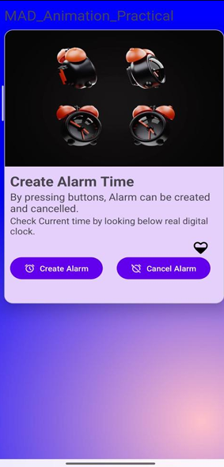

# Alarm Animation App

An Android application demonstrating drawable animations, tween animations, and alarm functionality with a splash screen.

## Features

- Animated splash screen with frame-by-frame and tween animations
- Alarm clock interface with looping alarm animation
- Heart animation that plays on the main screen
- Create and cancel alarm functionality with sound
- Material Design components
- Radial gradient background on splash screen

## Tech Stack

- **Kotlin** - Primary programming language
- **Android XML Layouts** - UI design
- **Material Components** - Material Design UI elements
- **AnimationDrawable** - Frame-by-frame animations
- **Tween Animations** - Transform animations
- **MediaPlayer** - Alarm sound playback

## Project Structure

```
com.example.a23012011153_practical6
├── MainActivity.kt                # Main screen with alarm functionality
├── SplashActivity.kt             # Splash screen with animations
├── res
│   ├── layout
│   │   ├── activity_main.xml     # Main screen layout
│   │   └── activity_splash.xml   # Splash screen layout
│   ├── drawable
│   │   ├── alarm_animation.xml   # Frame animation for alarm clock
│   │   ├── heart_animation.xml   # Frame animation for heart
│   │   ├── uvpce_animation.xml   # Frame animation for logo
│   │   └── splash_gradient.xml   # Radial gradient background
│   └── anim
│       └── splash_animation.xml  # Tween animations for splash
```

## Screens

<div align="center">
  <table>
    <tr>
      <td align="center"><b>Splash Screen</b></td>
      <td align="center"><b>Main Screen</b></td>
    </tr>
    <tr>
      <td></td>
      <td></td>
    </tr>
  </table>
</div>

### Splash Screen
- University logo with frame-by-frame animation
- Combined translate, rotate, and scale tween animations
- Radial gradient background (pink to blue)
- Auto-navigates to main screen after animation completes

### Main Screen
- Animated alarm clock image (10 frames, looping)
- Heart animation (5 frames, one-shot)
- Material Card with elevated design
- Create Alarm button - starts alarm sound
- Cancel Alarm button - stops alarm sound
- Sound continues in background when app is minimized

## Animations

### Frame-by-Frame Animations

**Alarm Animation**
- 10 frames (`alarm1` to `alarm10`)
- 200ms duration per frame
- Loops continuously

**Heart Animation**
- 5 frames (`ic_heart_0` to `ic_heart_100`)
- 400ms duration per frame
- Plays once on screen focus

**UVPCE Logo Animation**
- 8 frames showing logo reveal
- Variable durations (100-200ms)
- Plays once during splash

### Tween Animations

The splash screen combines multiple transformations:
- **Translate**: Moves logo across screen
- **Rotate**: 360-degree rotation
- **Scale**: Shrinks to 50% size
- **Start Offset**: 1000ms delay before starting

## Getting Started

### Prerequisites
- Android Studio (latest version recommended)
- Android SDK (minimum SDK 21)
- Kotlin plugin

### Installation

1. Clone the repository
2. Open the project in Android Studio
3. Add required drawable resources:
   - Alarm frames: `alarm1.png` to `alarm10.png`
   - Heart frames: `ic_heart_0.png` to `ic_heart_100.png`
   - Logo frames: `uvpce_logo_1.png` to `uvpce_logo.png`
   - Alarm sound: `alarm.mp3` in `res/raw`
4. Sync Gradle files
5. Run the application

### Dependencies

```gradle
dependencies {
    implementation 'androidx.core:core-ktx:1.12.0'
    implementation 'androidx.appcompat:appcompat:1.6.1'
    implementation 'com.google.android.material:material:1.11.0'
    implementation 'androidx.constraintlayout:constraintlayout:2.1.4'
}
```

## Key Components

### MainActivity
- Manages alarm and heart animations
- Implements alarm creation/cancellation
- Handles MediaPlayer lifecycle
- Manages button states based on alarm status

### SplashActivity
- Implements Animation.AnimationListener
- Combines frame and tween animations
- Navigates to MainActivity when animation ends

### Animation Resources

**alarm_animation.xml**: Looping alarm clock animation
**heart_animation.xml**: One-shot heart filling animation
**uvpce_animation.xml**: Logo reveal animation
**splash_animation.xml**: Combined transform animations
**splash_gradient.xml**: Radial gradient drawable

## Lifecycle Management

- Animations start/stop based on window focus
- MediaPlayer pauses when app goes to background
- MediaPlayer resumes when app returns to foreground
- MediaPlayer released properly in onDestroy()

## Manifest Configuration

- SplashActivity set as launcher activity
- MainActivity launched from splash screen
- Edge-to-edge display enabled

## Usage

1. App launches with animated splash screen
2. Logo animates with translate, rotate, and scale effects
3. Automatically navigates to main screen
4. Alarm clock and heart animations play continuously
5. Tap "CREATE ALARM" to start alarm sound
6. Tap "CANCEL ALARM" to stop alarm sound

## Author

**Aashish Sah**  
- GitHub: [@aashishsah005](https://github.com/aashishsah005)
- Email: aashishsah005@gmail.com

---

## Acknowledgments

- Android Documentation for Animation APIs
- Material Design Guidelines
- Stack Overflow Community
- Android Developers YouTube Channel

---

## Support

If you found this project helpful, please give it a ⭐ on GitHub!

---